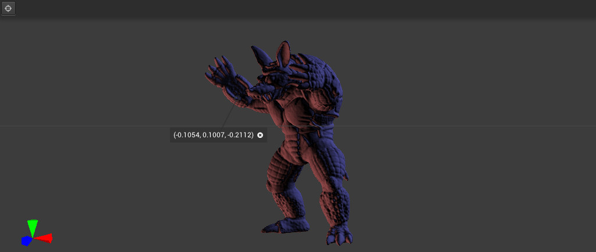

# sci3d
Lightweight interactive Scientific Visualization library
<center></center>

## Motivation
This library was created to cover a set of needs not fully supplied by currently available plotting libraries. It was designed with the following goals in mind:

### Real-time, dynamic, easy to interact 3D plots
[Matplotlib](https://matplotlib.org/) has some great 3D capabilities, but it's not very efficient for displaying animated plots. Furthermore, it's difficult to manually interact with the plots in such cases.

[Plotly](https://plotly.com/python/3d-charts/) is another advanced plotting library with support for 3D charts. Since it renders the the plots in HTML, that makes it a great fit for working with Jupyter notebooks. However, that means plots cannot be updated dynamically after they are created, which can make it less suitable for certain interactive applications.

### Easy to install, succint and self documented
Enthought's [Mayavi](https://docs.enthought.com/mayavi/mayavi/index.html) is a very complete tool, with a wide set of plotting capabilities that can be coupled with an MVC-like library of UI widgets. However, its dependencies make it difficult to install on environments that relies on too many libraries, such as Qt and OpenCV. Additionally, it may also require a lot of boilerplate code to achieve certain goals.

sci3d seeks to avoid these issues by adopting the following principles:
* Lean set of dependencies, minimizing potential for package conflicts
* API functions are always explicit and use type hints. This way, you can infer what a method expects without leaving your IDE. Likewise, you know what can be done with objects by relying on autocomplete features.

# Installation

## WSL2 requirements
If running from WSL2, you will need to install the latest mesa package on your Linux system. Check [this discussion](https://github.com/microsoft/WSL/discussions/6154) for some hints on how to do that.

After installing the latest mesa, make sure you have all the [requirements](#requirements).

## Requirements
sci3d relies on packages that have the following dependencies:

* libxrandr
* libxinerama
* libxcursor
* libxi
* libxext

On Ubuntu, these can be installed via:

```shell
sudo apt install libxrandr-dev libxinerama-dev libxcursor-dev libxi-dev libxext-dev
```

Finally, sci3d can be installed [via pip](#install-via-pip).

## Install via pip

```
pip install git+https://github.com/csantosbh/sci3d
```

# Usage
## Example
```python
import numpy as np
import sci3d as s3d
import time

# Create sphere SDF
def make_sphere(radius):
    sphere = np.mgrid[-1:1:32j, -1:1:32j, -1:1:32j].astype(np.float32)
    return np.linalg.norm(sphere, 2, 0) - radius

# Plot SDF
fig = s3d.isosurface(make_sphere(0.5))

# Wait while window is open
dt = 1.0/30
t = 0
while s3d.get_window_count() > 0:
    # Animate sphere by changing its size
    fig.set_isosurface(make_sphere(abs(0.5 + 0.3 * np.cos(t))))

    time.sleep(dt)
    t += dt
```

For more advanced examples, check the [demos](demos/).

## Controls

* **Left mouse button**: Rotate camera
* **Scroll**: Zoom
* **wasd**: Translate camera fps style. Press **shift** to move faster.